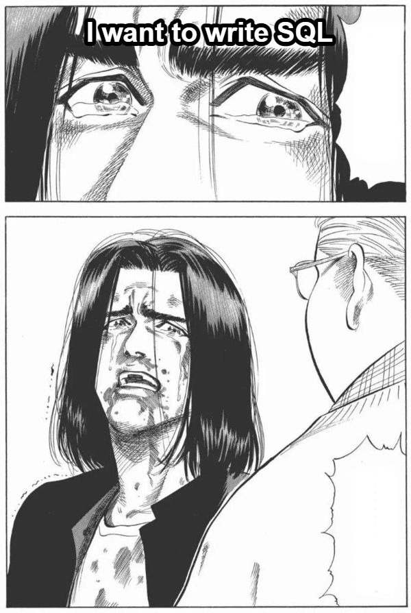
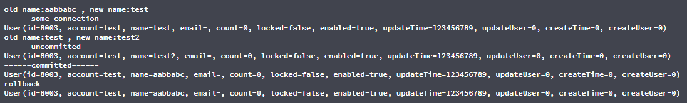

# Hi SQL

## Overview



## Requirement

* Spring Framework 5+
* Java 8+

## Default

* **Lower case naming**

    ```
    HelloWorld > hello_world
    ```

* **MySQL Pagination**

    ```sql
    select * from table limit 0,20
    ```

## QuickStart

[demo project](https://github.com/babyblue94520/hi-sql-demo)

### pom.xml

```xml
<dependency>
    <groupId>io.github.babyblue94520</groupId>
    <artifactId>hi-sql</artifactId>
    <version>0.0.4.1-RELEASE</version>
</dependency>
```

### Config

```java
@EnableHiSql
public class HiSqlConfig {
}
```

### Use

* **SQLCrudRepository**
    
    **Method**
    
    ```java
    public interface SQLCrudRepository<T> extends SQLRepository {
    
        long count();
    
        long count(T entity);
    
        long countById(Object... keys);
    
        List<T> findAll();
    
        Page<T> page(Pagination pagination);
    
        Next<T> next(Pagination pagination);
    
        T find(T entity);
    
        T findById(Object... keys);
    
        T insert(T entity);
    
        int update(T entity);
    
        int delete(T entity);
    
        int deleteById(Object... keys);
    
        int deleteAll();
    }
    ```
    
    **Simple**
  
    ```Java
    @Repository
    public interface UserRepository extends SQLCrudRepository<User> {
    
    }
  
    @Getter
    public class User {
    
        @Id
        @GeneratedValue
        private Long id;
    
        private String account;
    
        private String name;
    
        private String email;
    
        private Boolean locked;
    
        private Boolean enabled;
    
        @Column(name = "update_time")
        private Long updateTime;
    
        @Column(name = "update_user")
        private Long updateUser;
    
        @Column(name = "create_time", updatable = false)
        private Long createTime;
    
        @Column(name = "create_user", updatable = false)
        private Long createUser;
    }

    ```

* **SQLRepository**
    
    * **SQL expression**
      
        * **{sql} indicates the sql to be replaced**
        * **:value indicates parameter name**  
    
    **Repository**
    
    ```java
    @Repository
    public interface QueryRepository extends SQLRepository {
    @Sql(query = "select * from table where column1 = :value1 and column2 = :value2")
    List query(String value1, String value2);
    
    // where in
    @Sql(query = "select * from table where column1 in :values1 and column2 in :values2")
    List query2(String[] values1,Collection values2);
      
    @Sql(query = "select * from table where 1=1 {and1} {and2}")
    List query(String and1, String and2, String value1, String value2);
    }
    ```
    
    **Service**
    
    ```java
    public class QueryService {
      public List query(String value1, String value2) {
          queryRepository.query(value1, value2);
      }
    
      // where in
      public  List query2(String[] values1, Collection values2) {
          // values can't empty or null
          queryRepository.query2(values1, values2);
      }
    }
    ```
    
    * **Support return type**
    
        * **Basic Type**
        * **Java Bean**
        * **Map**
        * **Set**
        * **List**
        * **Page**
        * **Next**

        **Interface**
    
        ```java
        @Getter
        public class SimpleUser {
            private Long id;
            private String name;
        }

        @Repository
        public interface UserQueryRepository extends SQLRepository {
            @Sql("select id from user")
            Long findId();
        
            @Sql("select * from user")
            User find();
        
            @Sql("select id,name from user limit 0,10")
            List findAllSimpleMap();
        
            @Sql("select id,name from user limit 0,10")
            List<SimpleUser> findAllSimple();
        
            @Sql("select id,name from user")
            List<Map<String, Object>> findAllMap(Pagination pagination);
        
            @Sql("select id,name from user")
            List<SimpleUser> findAll(Pagination pagination);
        
            @Sql("select id from user")
            List<Long> findAllId(Pagination pagination);
        
            @Sql("select * from user")
            List<User> findAllId(Sort sort);
  
            @Sql("select id,name from user limit 0,10")
            Set findAllSimpleSetMap();
        
            @Sql("select id,name from user limit 0,10")
            Set<Map<String, String>> findAllSimpleSetMapString();
        
            @Sql("select create_time from user")
            Set<Long> findAllTime(Pagination pagination);
        
            @Sql("select * from user")
            Page<Map> mapPage(Pagination pagination);
        
            @Sql("select * from user where create_time between :startTime and :endTime {andId}{andName}")
            Page<User> page(
                    String andId
                    , String andName
                    , Pagination pagination
                    , Long startTime
                    , Long endTime
                    , Long id
                    , String name
            );
        
            @Sql("select id,name from user where name like ? limit ?,?")
            List<SimpleUser> findAllSimple(String name, int page, int size);
        
            /**
             * use method name to get hiSql from XML
             */
            List<Map<String, Object>> findAllMapXML(Pagination pagination);
        
            /**
             * use name to get hiSql from XML
             */
            @Sql(name = "pageMapXML")
            Page<User> pageMapXML(
                    String andId
                    , String andName
                    , Pagination pagination
                    , Long startTime
                    , Long endTime
                    , Long id
                    , String name
            );
            
        }
        ```

      **Example**

        ```java
        @RequestMapping("user/simple")
        @RestController
        public class UserQueryController {
        
            @Autowired
            private UserQueryRepository userQueryRepository;
        
            @GetMapping("one/id")
            public Long findId(
            ) throws Exception {
                return userQueryRepository.findId();
            }
        
            @GetMapping("one")
            public User find(
            ) throws Exception {
                return userQueryRepository.find();
            }
        
            @GetMapping("map")
            public Collection findAllSimpleMap(
            ) throws Exception {
                return userQueryRepository.findAllSimpleMap();
            }
        
            @GetMapping("map/2")
            public Collection findAllSimpleMap(
                    Pagination pagination
            ) throws Exception {
                return userQueryRepository.findAllMap(pagination);
            }
        
            @GetMapping
            public Collection findAllSimple(
            ) throws Exception {
                return userQueryRepository.findAllSimple();
            }
        
            @GetMapping("id")
            public Collection findAllId(
                    Pagination pagination
            ) throws Exception {
                return userQueryRepository.findAllId(pagination);
            }
        
            @GetMapping("set")
            public Collection findAllSimpleSetMap(
            ) throws Exception {
                return userQueryRepository.findAllSimpleSetMap();
            }
        
            @GetMapping("time")
            public Collection findAllSimpleSetMapString(
                    Pagination pagination
            ) throws Exception {
                return userQueryRepository.findAllTime(pagination);
            }
        
            @GetMapping("page/map")
            public Page mapPage(
                    Pagination pagination
            ) throws Exception {
                return userQueryRepository.mapPage(pagination);
            }
        
            @GetMapping("page")
            public Page<User> page(
                    Pagination pagination
                    , Long startTime
                    , Long endTime
                    , Long id
                    , String name
            ) throws Exception {
                return userQueryRepository.page(
                        id == null ? "" : "and id = :id"
                        , StringUtils.isEmpty(name) ? "" : "and name like :name"
                        , pagination
                        , startTime
                        , endTime
                        , id
                        , name
                );
            }
        
            @GetMapping("2")
            public Collection findAllSimple(
                    String name
                    , int page
                    , int size
            ) throws Exception {
                return userQueryRepository.findAllSimple(name, page, size);
            }
        
            @GetMapping("xml")
            public Collection findAllMapXML(
                    Pagination pagination
            ) throws Exception {
                return userQueryRepository.findAllMapXML(pagination);
            }
        
            @GetMapping("page/xml")
            public Page<User> pageMapXML(
                    Pagination pagination
                    , Long startTime
                    , Long endTime
                    , Long id
                    , String name
            ) throws Exception {
                return userQueryRepository.pageMapXML(
                        id == null ? "" : "and id = :id"
                        , StringUtils.isEmpty(name) ? "" : "and name like :name"
                        , pagination
                        , startTime
                        , endTime
                        , id
                        , name
                );
            }
        }
        ```
        
        **Advanced**
    
        * **bean parameter**
      
            ```java
            @Getter
            @Setter
            public class UserPageQuery {
                private Pagination pagination;
                private Long startTime;
                private Long endTime;
                private Long id;
                private String name;
            }
          
            @Getter
            @Setter
            public class UserSortQuery {
                private Sort sort;
                private Long startTime;
                private Long endTime;
                private Long id;
                private String name;
            }
            
            @Sql("select * from user where create_time between :query.startTime and :query.endTime {andId}{andName}")
            Page<User> page(
                String andId
                , String andName
                , UserPageQuery query
            );
    
            @Sql("select * from user where create_time between :query.startTime and :query.endTime {andId}{andName}")
            List<User> sort(String andId, String andName, UserSortQuery query);
            ```
        
        * **in()**
    
            ```java
            @Repository
            public interface UserQueryRepository extends SQLRepository {
                @HiSql("select * from user where (id,name) in :idNames")
                List<User> findAll(SimpleUser[] idNames);
                
                @HiSql("select * from user where (id,name) in :idNames")
                List<User> findAll(List<SimpleUser> idNames);
                
                @HiSql("select * from user where (id,name) in :idNames")
                List<User> findAll(Object[][] idNames);
            }

            ```

* **Write SQL on XML**

    * **root path resources/sqlquery/**
    * **{class package}/Repository.XML**
      
      ex: resources\sqlquery\pers\clare\demo\data\hiSql\UserQueryRepository.xml
      
    * Get SQL by **Method Name** or **@Sql(name=...)**
    
    ```xml
    <?xml version="1.0" encoding="UTF-8"?>
    <!DOCTYPE SQL>
    <SQL>
        <findAllMapXML><![CDATA[
            select id
                ,name
                ,create_time
            from user
        ]]></findAllMapXML>
        <pageMapXML><![CDATA[
            select *
            from user
            where create_time between :startTime and :endTime
            {andId}
            {andName}
        ]]></pageMapXML>
    </SQL>
    ```

* **@SqlConnectionReuse**
  
    Use the same connection to call different methods

    * **User-Defined Variables**
    * **Transaction**
    
    **Same connection**
      
    ```java
    @Repository
    public interface TransactionRepository extends SQLRepository {
    
        // mysql
        @Sql("update user set name = if(@name:=name,:name,:name) where id=:id")
        int updateName(Long id, String name);
    
        @Sql("select @name")
        String getOldName();
    }
  
    public class Service{
        
        @SqlConnectionReuse
        public String queryDefineValue(Long id, String name) {
            transactionRepository.updateName(id, name);
            return String.format("old name:%s , new name:%s", transactionRepository.getOldName(), name);
        }
  
    }
    ```
      
    **Transaction**
        
    * **Rollback on any exception**

    ```java
    public class TransactionExample {
        @SqlConnectionReuse(transaction = true)
        public void transaction(StringBuffer result, Long id, String name, int count) {
            //
        }
    }
    ```

    **Isolation**

    Use a different **Isolation** to create a new connection

    ```java
    import java.hiSql.Connection;
    
    public class IsolationExample {
        @SqlConnectionReuse(isolation = Connection.TRANSACTION_READ_UNCOMMITTED)
        public void transaction(StringBuffer result, Long id, String name, int count) {
          
        }
    }
    ```

    **Rollback example**

    ```java
    public class RollbackExample {
        public String rollback(Long id, String name) {
            StringBuilder sb = new StringBuilder();
            try {
                proxy().updateException(sb, id, name);
            } catch (Exception e) {
                sb.append(e.getMessage()).append('\n');
            }
            sb.append(userRepository.findById(id)).append('\n');
            return sb.toString();
        }
        
        @SqlConnectionReuse(transaction = true)
        public void updateException(StringBuilder sb, Long id, String name) {
        
            // first update user name
            String result = queryDefineValue(id, name);
            sb.append(result).append('\n');
            sb.append("------some connection------").append('\n');
            
            // select user in same connection
            User user = userRepository.findById(id);
            sb.append(user).append('\n');
        
            // second update user name
            result = queryDefineValue(id, name+2);
            sb.append(result).append('\n');
        
            // select uncommitted user in different connection
            sb.append("------uncommitted------").append('\n');
            user = proxy().findByIdUncommitted(id);
            sb.append(user).append('\n');
        
            // select committed user in different connection
            sb.append("------committed------").append('\n');
            user = proxy().findById(id);
            sb.append(user).append('\n');
            
            // rollback
            throw new RuntimeException("rollback");
        }
        
        @SqlConnectionReuse
        public User findById(Long id) {
            return userRepository.findById(id);
        }
        
        @SqlConnectionReuse(isolation = Connection.TRANSACTION_READ_UNCOMMITTED)
        public User findByIdUncommitted(Long id) {
            return userRepository.findById(id);
        }
    }
    ```

    


### **Advanced**

* **Change naming strategy**

    **UpperCase**
    ```java
    @EnableHiSql(
        naming = UpperCaseNamingStrategy.class
    )
    public class Demo2HiSqlConfig {
    }
    ```
  
    **Custom naming strategy**
    ```java
    public class CustomNamingStrategy implements NamingStrategy{
    }
  
    @EnableHiSql(
        naming = CustomNamingStrategy.class
    )
    public class Demo2HiSqlConfig {
    }
    ```

* **Change PaginationMode**
  
    ```java
    public class CustomPaginationMode implements PaginationMode{
    }
  
    @EnableHiSql(
        paginationMode = CustomPaginationMode.class
    )
    public class Demo2HiSqlConfig {
    }
    ```

* **Custom ResultSet Value Converter**

    ```java
    @Getter
    public class Device{
        private Integer id;
        private String name;
        private Pattern regex;
    }
    
    public class HiSqlConfig {
        static {
            // register Pattern converter
            HiSqlContext.addResultSetValueConverter(Pattern.class, (value) -> {
                if (value == null) return null;
                return Pattern.compile(String.valueOf(value));
            });
        }
    }
    ```
